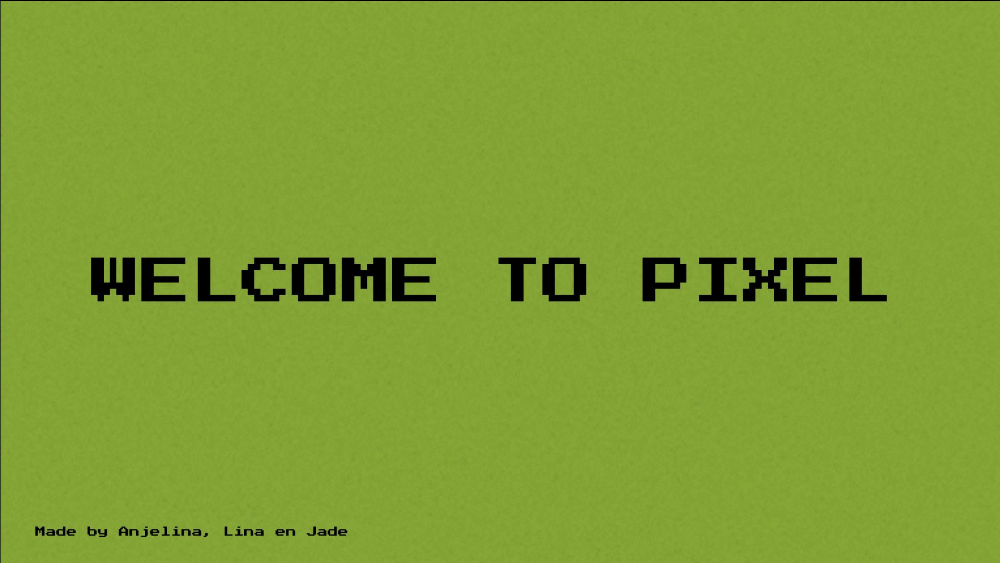

# PIXEL: A SOCIAL EXPERIMENT IN CONNECTION


Step into the world of Pixel, where two giant wooden Gameboys beckon from distant public places. With a single press of the start button, a mysterious connection is forged between them, and you find yourself face-to-face with a pixelated stranger.

Guided only by your voices, you and your partner embark on a journey of discovery. Randomly generated questions appear on the screen, encouraging you to share and connect on a deeper level. The twist? You can't see each other clearly, only pixelated fragments of your beings.

Pixel is a captivating social experiment that explores the power of vulnerability and human connection. Join us as we delve into the profound impact of limited visual information on our willingness to share, understand, and embrace the unknown.

Welcome to Pixel, where strangers meet, secrets unfold, and the pixelated tapestry of our lives reveals the beauty of true connection. Press "start" and let the experiment begin.

If you want to experience the magic of Pixel firsthand and discover the surprising insights it unveils, we invite you to watch our video and visit our website. Immerse yourself in this unique social experiment that challenges the boundaries of connection.

## Information

#### Video
[](https://www.youtube.com/watch?v=-LSQLKc2v48&ab_channel=JadeSleeckx )

#### Our Website
https://www.pixelgroup.info/

## Installation code

This code has a backend and frontend. The backend, which is the server using easyRTC, establishes the connection between the two users for the videocall. It also ensures that the prompts are connected to each other, so both users have the same question. The file 'server.js' utilizes the backend. The frontend encompasses everything else, including all the HTML, CSS, and two script files.

- install the required modules:

```
$npm install
```

- start the server:

```
$npm start
```


For more information and further steps, please refer to the details below.

## Back End

#### Viewing the call:
 - Start the localhost
    ```
    $npm run server
    ```

 - In your WebRTC enabled browser, visit your server address including the port. By default port 8080 is used.

 - Surf to http://localhost:8080/

 #### Explanation Code:
 - The code sets up a server using Node.js and the EasyRTC framework for real-time communication

 - It loads required modules such as `http`, `express`, `serveStatic`, and `socketIo`.

 - It imports the EasyRTC module for handling real-time communication functionalities.

 - The process name is set to "node-easyrtc" for identification purposes.

 - An Express app is created and configured to serve static files from a "static" subfolder.

 - An HTTP server is created using the Express app.

 - A Socket.io server is started and attached to the Express server for handling web socket connections.

 - The code defines an array of prompts that will be used in the social experiment.

 - A function is created to randomly select a prompt from the array and store it in the 'prompt' variable.

 - The `generatePrompt` function is called initially and every 2 minutes thereafter to update the prompt.

 - An interval is set to emit the current prompt to the connected socket clients every 10 seconds.

 - EasyRTC options are configured, setting the log level to "debug".

 - The code overrides the default `easyrtcAuth` event listener to access its callback and handle authentication.

 - Upon joining a room, the code logs the stored credential for each connection.

 - The EasyRTC server is started and listens for incoming connections.

 - The HTTP server listens on port 8080 (or an environment-specified port) for client requests.


## Front End
### Explanation Code:
#### Demo_audio_video_simple.js
 - The code initializes a variable `selfEasyrtcid` to store the EasyRTC client ID.

 - The `convertListToButtons` function is defined to convert a list of room occupants into clickable buttons.

 - The `clearConnectList` function removes all child elements from the "otherClients" div.

 - The `performCall` function is used to initiate a call to another EasyRTC client.

 - The `loginSuccess` function is called when the client successfully logs in.

 - The `loginFailure` function is called when there is a login failure.

 - The `connect` function is the entry point that sets up the EasyRTC settings, room occupant listener, and initializes the EasyRTC application.

 - The `connect` function also calls `resetGame` and `wsConnect` (presumably defined elsewhere).

 - Within the `convertListToButtons` function, the `otherClientDiv` element is cleared, and for each client in the `data` object, a button element is created.

 - The onclick event of each button is set to call the `performCall` function with the corresponding `easyrtcid`.

 - The button is appended to the `otherClientDiv`.

 - The code then removes the button immediately after appending it.

 - If there is only one client in the `data` object, a call is automatically performed to that client.

 - The `easyrtc.setVideoDims` function sets the video dimensions.

 - The `easyrtc.setRoomOccupantListener` function sets the listener for room occupants.

 - The `easyrtc.easyApp` function initializes the EasyRTC application with the given configuration.

 - The `loginSuccess` function assigns the `easyrtcid` to `selfEasyrtcid` and updates the "iam" element on the page.

 - The `performCall` function hangs up all current calls and initiates a call to the specified `otherEasyrtcid`.

 - The `loginFailure` function shows an error using `easyrtc.showError`.

#### script.js
 - The code initializes variables for various elements on the page using their respective IDs.

 - The functions `displayVideo`, `displayStart`, `hideStart`, `displayLoading`, `hideLoading`, `displayIntro`, `hideIntro`, `displayIntro2`, `hideIntro2`, `displayContainer`, and `resetGame` are defined to control the display and behavior of different elements.

 - The `resetGame` function is initially called to display the start screen.

 - The `socket` variable is created to establish a socket connection using the Socket.IO library.

 - The `socket.on` function listens for the 'prompt' event and updates the 'prompt' element on the page with the received prompt data.

 - The `socket.on` function also listens for the 'raspberry' event but does not perform any action.

 - The `ws` variable is declared.

 - The code checks the URL parameter 'ip' to determine the WebSocket URI to connect to.

 - The `wsConnect` function is defined to establish a WebSocket connection.

 - Inside the `wsConnect` function, a WebSocket connection is created using the specified `wsUri`.

 - Event handlers for the WebSocket connection are defined:

    - The `onmessage` event handler processes incoming messages and performs actions based on the received data. If the data is 'groen', it triggers a sequence of displaying and hiding various elements on the page. If the data is 'rood', it calls the `resetGame` function.

    - The `onopen` event handler logs that the connection is successfully established.

    - The `onclose` event handler logs that the connection is closed and attempts to reconnect every 3 seconds.

    - The `disconnect` function logs that the connection is disconnected.

 - The `wsConnect` function is initially called to establish the WebSocket connection.
## External Setup

### Materials
 - Laptop
 - Raspberry Pi
 - 4 buttons
 - 2 screens
 - 2 webcams

### 2 Gameboys

We have made 2 different ways to make the gameboy, using a lasercutter (wood) or using a cutting plotter (cardboard), you ofcourse can try to put something together yourself, this is you're choice.

The files you need for the lasercutter or cutting plotter are displayed in the folder recources. The Instructions of the detailes and how to use it are in the folder. These are our 2 gameboys, 1 in cardboard, 1 in wood.


